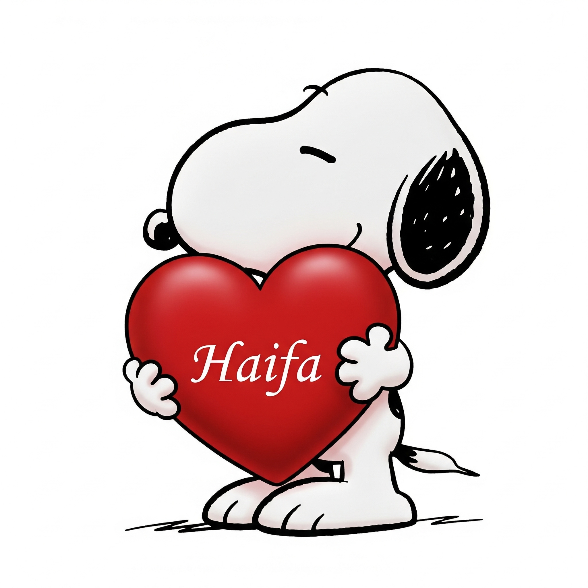

<br>

::: {style="border-top: 2px solid #003366;"}
:::

<br>


::: {style="height:20px;"}
:::


```{r setup, include=FALSE}
# Define opções padrão para todos os chunks de código no R Markdown
knitr::opts_chunk$set(
  echo = FALSE,         # Oculta o código nos resultados finais do documento
  warning = FALSE,     # Suprime mensagens de aviso (warnings)
  message = FALSE,     # Suprime mensagens informativas (como as de carregamento de pacotes)
  fig.width = 10,      # Define a largura padrão das figuras (em polegadas)
  fig.height = 6       # Define a altura padrão das figuras (em polegadas)
)

```


::: {style="text-align: justify"}
Oi, bom dia meu Anjo 😇! 

Está tudo bem contigo, de verdade, me importo muito? 

Dormiu bem?
:::

::: {style="height:20px;"}
:::

::: {style="text-align: justify"}

Sempre estarei aberto para conversarmos sobre qualquer coisa, tá bem? Estar contigo é uma honra. Peço desculpas pelo que aconteceu mais cedo; não queria, de forma alguma, te causar desconforto, aborrecimento ou tristeza.

:::

::: {style="height:20px;"}
:::

::: {style="text-align: justify"}
Entre todas as pessoas da minha vida, com exceção da minha família, tu és quem ocupa o lugar de maior carinho e afeto. São sentimentos que nos fazem olhar e pensar: “meu Deus, como isso é bom”. Por isso, gostaria muito que fosses parte da loucura que é a minha vida. Cada momento ao teu lado, mesmo quando éramos apenas amigos antes de nos aproximarmos mais, parecia o primeiro, pois continuo bobo como no início e nunca me canso de ti. Se for preciso te conquistar todos os dias, será um prazer imenso.
:::


::: {style="text-align: center"}

:::


::: {style="height:20px;"}
:::


::: {style="text-align: justify"}

Por isso, se em algum momento eu fizer algo que te machuque, me fala, por favor. Não suporto errar com quem amo; isso me dói demais. Se minhas atitudes te fizerem mal, quero entender e corrigir. Não tenho olhos para mais ninguém além de ti, e foda-se as outras pessoas, porque jamais trairia a tua confiança. Sou cabeça dura, mas sempre peço desculpas, não para agradar, e sim porque quero que estejamos bem, especialmente quando o erro é meu. Todos os dias tento ser uma pessoa melhor, um homem melhor e não agir como um babaca de 24 anos.
:::

::: {style="height:20px;"}
:::

::: {style="text-align: justify"}

Se quiseres que eu pare com qualquer coisa, me fala. Por gostar de ti, tenho o maior respeito pelas tuas decisões e jamais quero te magoar, ainda assim, sempre farei o que for melhor para ti. Não gosto de brigar de verdade, porque isso me machuca, e fico pensativo, pois me odeio quando faço mal às pessoas que amo, sabendo que elas só querem o meu bem.

:::

::: {style="height:20px;"}
:::

::: {style="text-align: justify"}

Eu te amo. Tu és como meus dias nublados, não porque são escuros, mas porque são bonitos, calmos e acolhedores. Mesmo com a tempestade que temos pela frente, escolho todos os dias estar ao teu lado.

:::

::: {style="height:20px;"}
:::

::: {style="text-align: justify"}

Aprecio demais a confiança que tens em mim, e cada detalhe teu é precioso. São as pequenas coisas que fazes, muitas vezes sem perceber, que me lembram a cada instante por que me apaixonei. Por isso, toda vez que te vejo, volto para casa feliz e leve, com o coração contente e ansioso pelo próximo encontro, porque sinto saudades tuas.

:::

```{r, include= FALSE, warning = FALSE, fig.width = 6, fig.height = 6}

suppressMessages(suppressWarnings({
  if (!requireNamespace("ggplot2", quietly = TRUE)) install.packages("ggplot2")
  if (!requireNamespace("plotly", quietly = TRUE)) install.packages("plotly")
}))
library(ggplot2)
library(plotly)


# Criação do coração
t <- seq(0, 2*pi, length.out = 1000)
x <- 16*sin(t)^3
y <- 13*cos(t) - 5*cos(2*t) - 2*cos(3*t) - cos(4*t)
df <- data.frame(x = x, y = y)

# Gráfico com texto no centro
p <- ggplot(df, aes(x, y)) +
  geom_polygon(fill = "deeppink", color = "red", size = 1) +
  annotate("text", x = 0, y = 0, label = "TE AMO GURIA", color = "white",
           size = 12, fontface = "bold") +
  theme_void() +
  coord_fixed() +
  ggtitle("💌 Com todo meu amor 💌") +
  theme(plot.title = element_text(hjust = 0.5, size=20, face="bold", color="darkred"))

# Tornando interativo
ggplotly(p)

```


::: {style="height:20px;"}
:::

::: {style="text-align: justify"}

Não sei se ficaremos juntos por muito tempo, caso me dês essa oportunidade, uma excelente pergunta, não acha?, mas se depender de mim, farei o possível e tudo o que estiver ao meu alcance para te ver sorrir e sempre te proporcionar o melhor. Desafios, responsabilidades e diversas circunstâncias, que vão além do simples fato de sentir algo.

:::


::: {style="height:20px;"}
:::


::: {style="text-align: justify"}

Bjs, te amo muito

Desejo que tenha um dia maravilhoso

Alexssandro
:::


::: {style="height:20px;"}
:::


<br>

::: {style="border-top: 2px solid #003366;"}
:::

<br>


